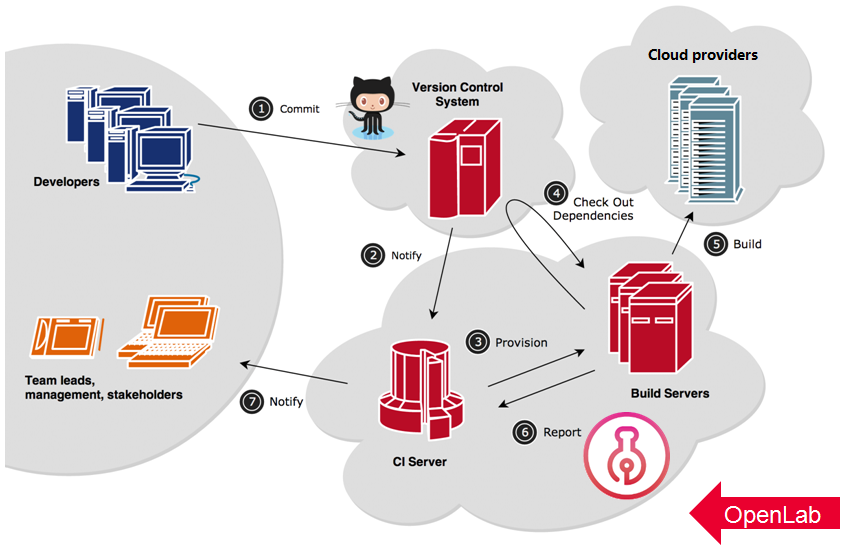

# Development Guide

## Prerequisites

The OpenLab CI is built based on `NodePool` and `Zuul` tools of the OpenStack infrastructure. The CI jobs definition uses Ansible playbooks. Learn more about the tools first:

* Zuul documentation is hosted on [Zuul](https://zuul-ci.org)
* NodePool documentation is hosted on [NodePool](https://zuul-ci.org/docs/nodepool/)
* Ansible documentation is hosted on [Ansible Docs](https://docs.ansible.com/)

## Testing workflow



### Working on test request with OpenLab CI

The accepted test requests can be found in [TODO list](https://github.com/orgs/theopenlab/projects/1#column-1860008), developers can get start with following steps:

1. Pick one test request you wish to work on, move it to [IN PROGRESS list](https://github.com/orgs/theopenlab/projects/1#column-1860011), edit it to add the development plan into comments
2. The target project of the request should install the **OpenLab-CI** [github APP](https://github.com/apps/theopenlab-ci), so that OpenLab CI system and target project can communicate with each other. See the details in [connecting guideline](connect-to-openlab.md)
3. Fork your own copy of the CI job repository [openlab-zuul-jobs](https://github.com/theopenlab/openlab-zuul-jobs) to your account, develop the test job and submit a PR\(Pull Request\) to [openlab-zuul-jobs](https://github.com/theopenlab/openlab-zuul-jobs). In order to manage the test request well, please add change details and link the test request number in PR's commit message, the format like:

   `Related-Bug: theopenlab/openlab#number`

4. OpenLab development team @theopenlab/dev will review the PR and give some suggestion, development core team @theopenlab/dev-core have permission to merge it if there is no issue, at the meanwhile, you should contact @theopenlab/dev-core to add the target project into **main.yaml** in **zuul** node if it is not in project list of zuul
5. When your PR is merged into master of [openlab-zuul-jobs](https://github.com/theopenlab/openlab-zuul-jobs), trigger to test the integration job by [trigger comments](supported-trigger-comments.md), see the [build status](http://status.openlabtesting.org/builds), click result `FAILURE` enter the build web page and then click the `log url` to get the log details if the job fail. Maybe you can find some problems of job, feel free to submit new pull request to [openlab-zuul-jobs](https://github.com/theopenlab/openlab-zuul-jobs/pulls) to fix job issue, link the issue number of related test request in PR's commit message as we do on step3  
6. Close the `In Progress` test request by yourself when the work completely, notify @theopenlab/governance and @theopenlab/docs to update website and documents in RP comments.

### Working on test request with OpenLab physical machine

1. If your test request need some physical machines, please contact @theopenlab/governance members in IRC channel or send them an email, they will help you to get OpenLab dedicated resources to launch testing
2. When you can access the physical machines, move your test request to [IN PROGRESS list](https://github.com/orgs/theopenlab/projects/1#column-1860011), edit it to add the development plan into comments
3. When the work is completely, close the `In Progress` test request by yourself, please commit the test result into comments of test request related issue. A blog also is a good choice to show more details of testing. Notify @theopenlab/governance and @theopenlab/docs to update website and documents in RP comments.

### Working on feature and bug

1. Features and bugs for OpenLab are tracked in [issue list](https://github.com/theopenlab/openlab/issues) 
2. Perhaps the merged CI job will fail due to some reasons after it has been running for some time, or if you find any other enhancement points or problems of OpenLab, welcome to [new](https://github.com/theopenlab/openlab/issues/new/choose) an issue
3. The development core team @theopenlab/dev-core will confirm the feature or bug, add them into [TODO list](https://github.com/orgs/theopenlab/projects/1#column-1860008)
4. You can assign one feature or bug from TODO list, move it to [IN PROGRESS list](https://github.com/orgs/theopenlab/projects/1#column-1860011). Feel free to pick up the issues with label [need volunteer](https://github.com/theopenlab/openlab/labels/need%20volunteer), these issues are not claimed by anyone yet 
5. Submit a PR\(Pull Request\) to [openlab-zuul-jobs](https://github.com/theopenlab/openlab-zuul-jobs) to implement feature or fix bug, please add change details and link the issue number in PR's commit message:

   `Closes: theopenlab/openlab#{number}`

   `Related-Bug: theopenlab/openlab#{number}`

6. OpenLab development team @theopenlab/dev will review the PR and give some suggestion, development core team @theopenlab/dev-core have permission to merge it if there is no problem. When the PR is merged into openlab-zuul-jobs, you can test jobs by [trigger comments](supported-trigger-comments.md)
7. Close the `In Progress` feature or bug by yourself when feature is implemented or bug is fixed.

## Integrate with OpenLab CI

There are two ways to integrate development activities of target project with OpenLab CI, you can apply them individually in different scenarios, and applying both two ways is OK to OpenLab.

1. Pull request of target project triggered
   * Pros: Verifying against with pull request commit to avoid merging code with issue into master
   * Cons: Need to install OpenLab github APP into target project for receiving github events, refer to [Connect to OpenLab](connect-to-openlab.md)
2. Periodic pipeline of OpenLab triggered
   * Pros: Don't need to install OpenLab github APP into target project
   * Cons: Verifying in a fixed period, issues maybe exist in master of target project, issue detection and resolution are delayed.

### Branch range of target and backend project validated by OpenLab

OpenLab focus on verifying cross community application integration scenario, we assume base platform \(backend\) is stable and available to use, like: Kubernetes, OpenStack and so on, and assume target project should be improved to work together well with base platform \(backend\), so the following table show the scope OpenLab should covered.

| Target project | Backend | OpenLab scope |
| :--- | :--- | :--- |
| master | master | yes |
| master | released | yes |
| released | released | yes |
| released | master | no |


The last case is just to verify backend project, should be covered in backend project CI.


### Job naming notations

When we implement an integration test request, usually we need to add new job into [openlab-zuul-jobs](https://github.com/theopenlab/openlab-zuul-jobs/tree/master/playbooks). To unify the job name format, we have the following naming notations:

```text
{target project}-{target project version}-{test type}-{backend}-{backend version}
```

* The _**target project**_ usually is the name of the project repository which contains tests to run.
* The _**version**_ is the version of target project, optionally, default is `master`.
* The _**test type**_ is the type of test to run, e.g. acceptance test, integration test, unit test or build.
* The _**backend**_ is the test environment provider, include: deploying tools, public cloud, hardware platform, e.g. devstack, kubeadm, minikube, VEXXHOST, aarch64, optionally, default is `devstack`.
* The _**backend version**_ is the specific _**backend**_ version which this job will run against, optionally, default is `master`.

For an example, the job definition about running master acceptance tests of terraform-provider-openstack against with master OpenStack that is deployed by devstack can be named as:

```text
terraform-provider-openstack-acceptance-test
```

Running Spark v2.4.3 integration test against Kubernetes 1.13.0 that is deployed by minikube:

```text
spark-v2.4.3-integration-test-minikube-k8s-1.13.0
```

Running Hadoop master build test on aarch64 platform, platform should be consistent with `uname -m`:

```text
hadoop-build-aarch64
```

### Job inherit

OpenLab's job definition should support to put multiple versions of target project together with multiple backends to verify integration stacks as more as possible, the version matrix looks like:

| Job name | Target project | Backend |
| :--- | :--- | :--- |
| JobA | Spark v2.4.3 | Kubernetes 1.14.0 |
| JobB | Spark v2.4.3 | Kubernetes 1.13.0 |
| JobC | ... | ... |
| JobX | Spark v2.3.3 | Kubernetes 1.14.0 |
| JobY | Spark v2.3.3 | Kubernetes 1.13.0 |
| JobZ | ... | ... |

Considering test resource limits of OpenLab, we will cover master and latest released of target project and non-EOL backends at the begin, but if you have special needs to specific testing versions, please commit a [test request](testing-request.md) in OpenLab, let us knowing that, just like we have support multiple OpenStack EOL releases in OpenLab integration tests.

Supporting so many integration tests is not a easy thing for OpenLab CI, should design job inherit structure carefully and try to reuse Ansible playbook to support multiple different testing cases, please follow the rule to add your code:

* Define a base OpenLab zuul job and playbook for master of target project and master of backend. Base, son and grandson jobs run against same playbook `run.yaml` .



```yaml
- job:
    name: spark-master-integration-test-kubeadm-k8s-master
    parent: init-test
    run: playbooks/spark-integration-test-kubeadm-k8s/run.yaml
```



* The son job should be pinned to a specific backend version to testing and inherit from base job. The playbook `run.yaml` of base job is important, that can switch backend version based on input variable, refer to [openlab-zuul-jobs/roles/create-single-k8s-cluster-with-kubeadm](https://github.com/theopenlab/openlab-zuul-jobs/blob/master/roles/create-single-k8s-cluster-with-kubeadm/tasks/main.yml#L20-L25).



```yaml
- job:
    name: spark-master-integration-test-kubeadm-k8s-1.14.0
    parent: spark-master-integration-test-kubeadm-k8s-master
    vars:
      kubernetes_version: 1.14.0
```



* The grandson job should be pinned to a specific target project version to testing and inherit from son job, we can use Zuul built-in attribute `override-checkout` to checkout target project code to specific branch or tag.



```yaml
- job:
    name: spark-v2.4.3-integration-test-kubeadm-k8s-1.14.0
    parent: spark-master-integration-test-kubeadm-k8s-1.14.0
    override-checkout: v2.4.3
```



## Periodic job and pipeline schedule

OpenLab manage lots of periodic jobs for many projects, these jobs will be triggered by [OpenLab CI](http://status.openlabtesting.org) to execute testing and collect result in everyday. For decreasing OpenLab resource usage, we should split all of periodic jobs into each pipeline as evenly as possible, and avoiding concurrent jobs with same test target affect each other. So there are three basic principles to help you to decide which pipeline when you want to add new periodic job:

1. Split all of periodic jobs into each pipeline as evenly as possible.
2. Job backend is local deployed OpenStack, Kubernetes and other, that is OK in same pipeline.
3. Choose the trigger time you like.

#### Current pipeline and job mapping:

<table>
  <thead>
    <tr>
      <th style="text-align:left">Pipeline Name</th>
      <th style="text-align:left">
        <p>Trigger Time</p>
        <p>(UTC-0)</p>
      </th>
      <th style="text-align:left">Projects</th>
      <th style="text-align:left">Job count</th>
    </tr>
  </thead>
  <tbody>
    <tr>
      <td style="text-align:left">periodic-0/12</td>
      <td style="text-align:left">0:00/12:00</td>
      <td style="text-align:left">
        <p><a href="https://github.com/theopenlab/openlab-zuul-jobs/blob/master/zuul.d/projects.yaml">ansible/ansible</a>
        </p>
        <p><a href="https://github.com/theopenlab/openlab-zuul-jobs/blob/master/zuul.d/projects.yaml">apache/spark</a>
        </p>
      </td>
      <td style="text-align:left">11</td>
    </tr>
    <tr>
      <td style="text-align:left">periodic-2/14</td>
      <td style="text-align:left">2:00/14:00</td>
      <td style="text-align:left">
        <p>terraform-providers/terraform-provider-openstack</p>
        <p>containerd/containerd</p>
        <p><a href="https://github.com/theopenlab/openlab-zuul-jobs/blob/master/zuul.d/projects.yaml">helm/charts</a>
        </p>
      </td>
      <td style="text-align:left">10</td>
    </tr>
    <tr>
      <td style="text-align:left">periodic-4/16</td>
      <td style="text-align:left">4:00/16:00</td>
      <td style="text-align:left">
        <p><a href="https://github.com/theopenlab/openlab-zuul-jobs/blob/master/zuul.d/projects.yaml">cloudfoundry/bosh-openstack-cpi-release</a>
          <br
          /><a href="https://github.com/theopenlab/openlab-zuul-jobs/blob/master/zuul.d/projects.yaml">kubernetes/cloud-provider-openstack</a>
        </p>
        <p>envoyproxy/envoy</p>
      </td>
      <td style="text-align:left">11</td>
    </tr>
    <tr>
      <td style="text-align:left">periodic-6/18</td>
      <td style="text-align:left">6:00/18:00</td>
      <td style="text-align:left">
        <p><a href="https://github.com/theopenlab/openlab-zuul-jobs/blob/master/zuul.d/projects.yaml">hashicorp/packer</a>
        </p>
        <p><a href="https://github.com/theopenlab/openlab-zuul-jobs/blob/master/zuul.d/projects.yaml">kubernetes-sigs/kind</a>
        </p>
      </td>
      <td style="text-align:left">10</td>
    </tr>
    <tr>
      <td style="text-align:left">periodic-8/20</td>
      <td style="text-align:left">8:00/20:00</td>
      <td style="text-align:left">
        <p><a href="https://github.com/theopenlab/openlab-zuul-jobs/blob/master/zuul.d/projects.yaml">docker/machine</a>
        </p>
        <p>gophercloud/gophercloud</p>
      </td>
      <td style="text-align:left">15</td>
    </tr>
    <tr>
      <td style="text-align:left">periodic-10/22</td>
      <td style="text-align:left">10:00/22:00</td>
      <td style="text-align:left">
        <p><a href="https://github.com/theopenlab/openlab-zuul-jobs/blob/master/zuul.d/projects.yaml">manageiq/manageiq-providers-openstack</a>
          <br
          /><a href="https://github.com/theopenlab/openlab-zuul-jobs/blob/master/zuul.d/projects.yaml">kubernetes-sigs/cluster-api-provider-openstack</a>
        </p>
        <p>dtantsur/rust-openstack</p>
      </td>
      <td style="text-align:left">12</td>
    </tr>
  </tbody>
</table>